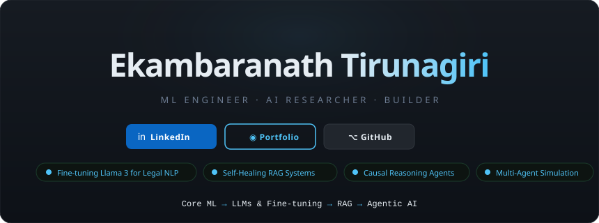
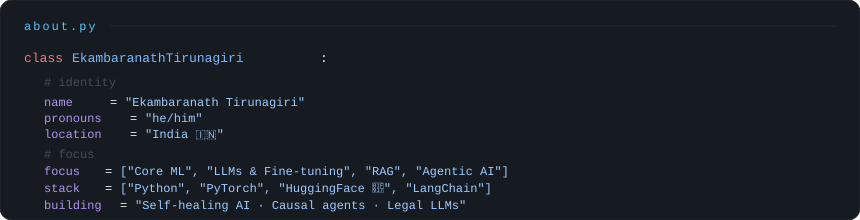

<!-- ═══════════════════════════════════════════════ -->
<!--                    HERO                        -->
<!-- ═══════════════════════════════════════════════ -->

<!-- Clickable badge row sits BELOW the SVG, visually grouped -->
 

&nbsp;&nbsp;
&nbsp;&nbsp;

  

---

---

> Classical ML · Deep Learning · Computer Vision · Biomedical AI

<table>
<tr>
<td width="50%">

**[🫀 Heart Disease Classification](https://github.com/ekambaranath/Heart_Disease_Classification)**

Binary classification using clinical features — EDA, feature engineering, and model comparison.

</td>
<td width="50%">

**[📈 Gold Price Prediction](https://github.com/ekambaranath/gold_price_prediction)**

Time-series regression forecasting gold prices with macroeconomic indicators and correlation analysis.

</td>
</tr>
<tr>
<td width="50%">

**[🔬 Cancer Detection — CNN](https://github.com/ekambaranath/Histopathological_cancer_detection_using_CNN_Architecture)**

CNN for histopathological slide classification — detecting malignant tissue from pathology images.

</td>
<td width="50%">

**[🧠 Brain MRI Segmentation](https://github.com/ekambaranath/brain-MRI-segmentation)**

Deep learning segmentation of brain MRI scans for precise tumor boundary localization.

</td>
</tr>
<tr>
<td width="50%">

**[👥 Customer Segmentation](https://github.com/ekambaranath/customer-segmentation)**

Unsupervised clustering (K-Means, DBSCAN) segmenting customers by behavior and demographics.

</td>
<td></td>
</tr>
</table>

---

> Instruction Tuning · Domain Adaptation · Large Language Model Workflows

<table>
<tr>
<td width="50%">

**[⚖️ Fine-tuning Llama 3 — Legal NLP](https://github.com/ekambaranath/Finetuning_Llama3_legal)**

Llama 3 fine-tuned on legal domain datasets for contract understanding, clause classification, and legal Q&A.

&nbsp;

</td>
<td width="50%">

**✦ More Coming Soon**

Exploring RLHF & DPO alignment techniques, LoRA / QLoRA efficient fine-tuning, and domain-specific LLM benchmarking.

</td>
</tr>
</table>

---

> Retrieval-Augmented Generation · Autonomous Agents · Causal Reasoning

<table>
<tr>
<td width="50%">

**[🩺 selfHealingRAG](https://github.com/ekambaranath/selfHealingRAG)** &nbsp; 

RAG pipeline with built-in self-healing — detects retrieval failures and autonomously corrects them.

</td>
<td width="50%">

**[🕵️ causal\_RCA\_Agent](https://github.com/ekambaranath/causal_RCA_Agent)** &nbsp; 

Agentic root cause analysis using causal inference graphs — autonomously diagnoses complex system failures.

</td>
</tr>
<tr>
<td width="50%">

**[🌐 emergentSocietySimulator](https://github.com/ekambaranath/emergentSocietySimulator)** &nbsp; 

Multi-agent simulation where LLM-driven agents develop emergent social norms, economies, and behaviors.

</td>
<td width="50%">

**[💬 interactive\_RAG\_chatbot](https://github.com/ekambaranath/interactive_RAG_chatbot)**

Conversational chatbot with RAG backbone — retrieves context dynamically for accurate, grounded responses.

</td>
</tr>
</table>

---

 

 

---

